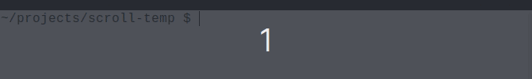

## Introduction

Show information on console without using a lot of real estate screen by letting it scroll horizontally like those electronic stock ticker tape

## How to use it

Install the package

``` console
$ npm i --save scroll-lines
```

Pass an array of strings  and the speed in miliseconds to the scroll function

``` javascript
const { scroll } = require('scroll-lines')

const text = [
  'Lorem ipsum dolor sit amet...',
  'Idioms are a wonderful part of the English...'
]

scroll(text, 100)
```

The result will be shown on the console




